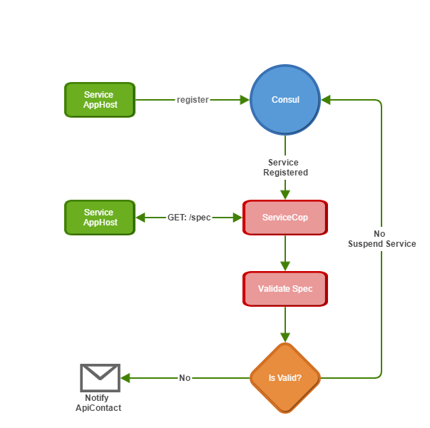

# ServiceStack.IntroSpec.ServiceCop

#### You have 20 seconds to comply... ;)

ServiceStack.IntroSpec.ServiceCop is a service validator for servicestack.

Built on top of our api spec plugin, [IntroSpec](https://github.com/MacLeanElectrical/servicestack-introspec) and 
our service registry, [Consul Service Discovery](https://github.com/MacLeanElectrical/servicestack-discovery-consul), 
ServiceCop can be configured to enforce and validate consistency in your api services.

The packaged rules include naming, documentation, contract and versioning, unbounded result checks, 
plugins and security but are configurable depending on your requirements.

## How it works

When a service is registered with a service registry, which we default to our ServiceStack.Discovery.Consul plugin,
a trigger is fired which calls ServiceCop for validation.

ServiceCop then requests the `/spec` endpoint of our IntroSpec plugin from the registered service.
Should the service not implement IntroSpec, it will be suspended from the service registry and therefore be unavailable
for use by other services.

Once the spec is downloaded, it will then be validated using the set of validation rules configured for this service.
Should a service fail any of these rules, the service will again be suspended from the service registry with the 
failure message and a notification will be send to the `ApiContact` defined in the api spec.

In addition this service contains endpoints to validate services during development or deployment to ensure 
they comply with the rules prior to deployment. This promotes consistency as distributed teams are developing 
api services.

## Example rules

The rules enforced are intended to be bespoke to each implementation and exceptions to each rule can be added on a DTO by DTO basis, 
but some examples of rules are included below.

### Plugins

By default, this service expects that services must have at least two plugins installed, the first is service discovery, without
which the validation would not be called and the second is IntroSpec which provides a consistent model with which to validate services.

Additional plugins and minimum versions can be enforced among services 

 + Security : By default, all our api's must include our IdentityServer plugin, to us, there is no such thing as an anonymous api request.
 + Rate-limit : Again by default, our api's must include as standard our rate-limit plugin, regular data scraping using api's is a sign that an api is being mis-used for aggregation purposes.
 + Correlation : By default, our api's must include our correlation plugin, this tracks dependency chains between service to service requests and provides circuit-breakers should services introduce circular dependencies or overly long call-chains.
 + Versioning : Plugin upgrades can be either enforced through minimum required versions or through early notification to api maintainers for planned obsolescence.
 + ConsulAppSettings : Hard-coding configuration data in service instances forces re-deployments over dynamic updates, we enforce this plugin to encourage use of dynamic service configuration.

### Naming

Naming uniqueness and consistency aid discoverability.

 + Request Prefix-Postfix : All requests should have a prefix or postfix, for example, postfixed 'Request'
 + Response Prefix-Postfix : All responses should have a prefix of postfix, for example postfixed 'Response'
 + Request/Response matching pairs: All request/responses should match without a prefix/postfix
 + Request/Response complexity : All requests should have a minimum complexity to avoid potential name clashes, for example `GetStatus` or `GetData` are too broad to be of use in a global api catalogue and will likely clash as more services are added.
 + Request Verbs : Requests using verbs in the name [[Get, Post, Put, Delete]] should implement the matching verb in the service. 
 + Request Uniqueness : Avoid naming conflicts between services

### Documentation

Promote minimum acceptable documentation standards for the benefit of api consumers.

 + DTO Description : Every DTO should contain a description of minimum length
 + DTO Property Descriptions : Every DTO property should contain a description
 + DTO Required : Each service endpoint can be called using only the properties marked as required and if a validation error occurs, raise a validation failure.

### Lists

Encourage predictable server load and api responsiveness.

 + Unbounded results : All responses that return IEnumerable results can be checked for implementations of result paging. It is generally undesirable to have api DTO's that can return an unlimited set of results.

### Contracts

Eliminate or ease versioning problems for API consumers.

 + Non-breaking changes : ServiceCop can store a snapshot of each DTO upon successful service validation. Should a DTO be changed with breaking changes such as the removal or type change of a property, the DTO can fail validation enforcing backwards-compatibility.
 + DTO relocation : A DTO must be globally unique, in the event of a DTO being moved, an exception can be raised which first suspends the service pending verification and if accepted, will force the DTO requests to be redirected to the new service and a notification sent to the existing service ApiContact to remove the obsolete/moved DTO.

### Dependencies

Identify potential api circular-dependencies and obsolete DTO's

 + Each spec can output the external DTO's and their AssemblyVersion to enforce min versions or issue planned obsolescence notifications.